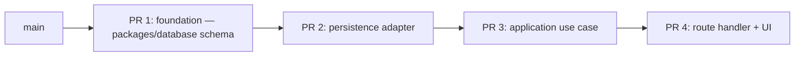

# Split Technical Story

Use when `/split` runs — work has grown too large for one PR (per `.cursor/rules/79-pr-sizing.mdc` §2) or touches too many concerns to review in one diff.

## When to use

- An active diff exceeds the size limits in `79-pr-sizing.mdc` §2.
- A single Implementation Plan has grown to cover multiple distinct user benefits.
- A refactor and a feature are tangled in the same branch.
- The `pr-readiness-checker.md` returned BLOCKED on PR-B1 / B2 / B3 / B5 / B6 with no exemption.

## Read first

- `.cursor/rules/79-pr-sizing.mdc` (canonical sizing rules)
- `~/.cursor/skills-cursor/split-to-prs/SKILL.md` (Cursor-first-party patterns this skill mirrors and extends)
- `.cursor/agents/execution/architect.md` (Plans for stacked PRs)

## Hard rules (preserved from first-party `split-to-prs`)

- Do not create branches, commit, push, or open PRs until the user approves the split plan.
- Never discard user work. No destructive git commands (`reset --hard`, `clean -fdx`, branch deletion, force-push, history rewrite) without explicit approval.
- Always save a recoverable snapshot before moving work around. This often starts from dirty work on `main`, so do not assume there is already a safe branch.
- Stage only named files or hunks. No `git add .` / `git add -A`.

## Recipe

### Step 1 — Check the state

Run:

```bash
git status
git diff <base>...HEAD
git log --oneline <base>..HEAD
```

Summarize the real slices you see. Cross-reference with the active Implementation Plan(s) — the slices often align with the Plan's `Layers Affected`.

Find ownership signals: `CODEOWNERS`, package boundaries (post-migration), or the layered structure (`domain` / `application` / `infrastructure` / `app`).

### Step 2 — Propose the split

The split is **Plan-aware**: each output PR is its own Implementation Plan (or shares a Plan that already decomposes cleanly). Default to **independent PRs off the default branch**. Stack only when the dependency is real.

For each output PR:

- Title prefix (per `79-pr-sizing.mdc` §3 if exemption applies; otherwise just descriptive).
- Touched files (subset of the original diff).
- Layer touched.
- Base branch (default branch, or parent PR if stacking).
- Order of merge.

Output a Mermaid diagram when ≥ 3 slices:



### Step 3 — Wait for user approval

Show the proposal. Wait for `approved`. Do not branch / commit / push without it.

### Step 4 — Save a recoverable snapshot

```bash
SHA=$(git stash create "pre-split")
if [ -n "$SHA" ]; then
  git update-ref "refs/backup/pre-split-$(date +%s)" "$SHA"
fi
```

This preserves the dirty working tree before any rearrangement.

### Step 5 — Execute the split

For each approved slice:

1. `git checkout <base>` (default branch or parent PR for stacking).
2. `git checkout -b <feature-branch>`.
3. Stage only the planned files / hunks (`git add <path>` or `git add -p`).
4. `git commit -m "<conventional commit>"`.
5. `git push -u origin <feature-branch>`.
6. Open the PR (`gh pr create --base <parent>` for stacked).

Each PR runs `pr-readiness-checker.md` on its own. A stacked PR's base is its parent in the stack.

### Step 6 — Report back

```txt
Split — result

Original branch: <name> (preserved at refs/backup/pre-split-<ts>)

Output PRs:
1. PR #<N>: <title> — <url> — base: main
2. PR #<N+1>: <title> — <url> — base: PR #<N>
3. PR #<N+2>: <title> — <url> — base: PR #<N+1>

Backup ref: refs/backup/pre-split-<ts> (kept until you delete)

Next:
- /babysit each PR through review + merge
- Stack merges in order: PR #<N> first
```

## Plan-aware decomposition heuristics

When in doubt, split along these axes (in order of preference):

1. **Layer** — `infrastructure/persistence/` schema PR before `application/` use case PR before `app/` route PR.
2. **Package** (post-migration) — one PR per package touched.
3. **Owner** — natural reviewer boundary per `CODEOWNERS`.
4. **Refactor vs feature** — never bundle.
5. **Dependent vs independent** — independent PRs off main; stacked PRs only when the dependency is real.

## Hard stops

- Refuse to force-push to main / master.
- Refuse to discard user work. Always save a backup ref first.
- Refuse to merge stacked PRs out of order.
- Refuse to bundle a refactor and a feature in the same output PR — the original problem.

## Hard rules

- User approves the split before any branch / commit / push.
- Backup ref preserved until the user explicitly says to delete it.
- Each output PR independently passes `pr-readiness-checker.md`.
