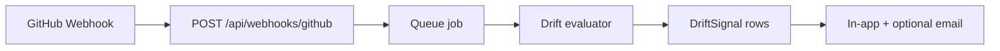

Owner : Product + Eng lead — Priorité : 🟠 — Trimestre 1

> **Dépendances :** `prd-drift-github-v1-spec.md` (même connexion GitHub).

# Living PRD — webhook GitHub (brief technique)

## Objectif

Réagir **en quasi temps réel** aux événements repo → suggestion « section X peut être obsolète ».

---

## Événements écoutés (v1)

| GitHub event | Action Zedos |
|--------------|--------------|
| `push` sur `main` | Scan commit messages + fichiers touchés (README, docs/) |
| `issues.opened` | Compare titre/labels vs `out_of_scope` + `core_features` |
| `release.published` | Compare notes vs `timeline` |

**Pas v1 :** `pull_request` review comments, Actions logs.

---

## Pipeline

---

## Payload → DriftSignal

| Champ | Source |
|-------|--------|
| `signalType` | DRIFT-01..04 |
| `evidence` | URL issue/commit |
| `suggestedSectionIds[]` | Heuristique + optional LLM |
| `status` | open \| resolved \| dismissed |

---

## Idempotence

- `deliveryId` GitHub → ignore duplicate.
- Rate limit : max 10 evaluations / projet / heure.

---

## Sécurité

- Vérifier signature `X-Hub-Signature-256`.
- RepoId doit matcher projet owner.

---

## Critères d’acceptation (impl)

| AC | Description |
|----|-------------|
| AC-1 | Webhook test GitHub → 1 DriftSignal en &lt; 2 min |
| AC-2 | Push README only → DRIFT-01 si mismatch |
| AC-3 | Issue hors scope → DRIFT-02 |

---

## Hors scope

- Écriture automatique dans PRD
- Sync bidirectionnel

---

## Critères done

- [x] Events + pipeline + AC.
- [ ] Slice WORK_QUEUE après drift v1 slice 1.
