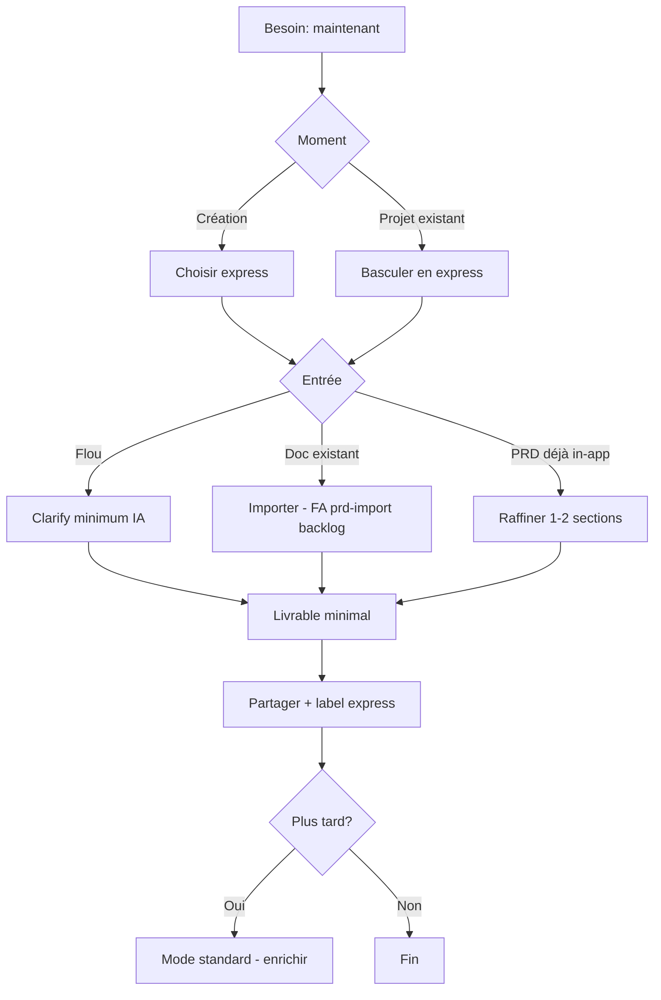

# Diagnostic produit — Hics & backlog (Zedos)

> **Date** : 2026-06-03  
> **Nature** : diagnostic & prioritisation produit — **pas** un plan de développement.  
> **Décisions fast-track** : `docs/product-decisions/PD-002.md` (acceptées).  
> **Feature Area** : `docs/product/feature-areas/fast-track-urgent.md`

---

# Diagnostic

Zedos fonctionne bien comme **machine à produire un premier PRD** (clarification → génération → versions → partage).  
Le décalage : on traite tout le monde comme s’il avait **le temps** de faire la découverte complète, alors qu’une part importante des sessions est **contrainte par le temps**.

**Hypothèse implicite aujourd’hui** : idée floue → beaucoup de questions → PRD riche → ensuite le reste.  
**Réalité terrain** : PRD déjà fait, deadline, pitch demain, pivot — besoin de **vitesse variable**.

---

# Les hics (par gravité)

| # | Hic | Gravité | Géré aujourd’hui ? | Symptôme |
|---|-----|---------|---------------------|----------|
| **H1** | **Fast-track / urgent** | **Critique** | **Partiel ~25 %** | `journeyMode` express livré ; livrable 12 sections + disclaimer + shell grisé **Planned v0** (`docs/WORK_QUEUE.md`) |
| H2 | PRD déjà existant (externe) | Haute | **Doc prête, pas shipped** | FA `prd-import` + slice ; Q-028 v0 — impl backlog |
| H3 | Où j’en suis sur le projet | Haute | Partiel | Onglets sans fil narratif |
| H4 | Évoluer le PRD après coup | Moy.–haute | Partiel | Pas de boucle « priorités changées » |
| H5 | Multi-projets : reprendre | Moyenne | Faible | Liste sans état |
| H6 | Post-PRD verrouillé | Moyenne | Partiel | `phase` peu expliquée |
| H7 | App web vs Cursor `docs/prd/` | Basse | Non | Double source de vérité |

---

# Fast-track — décisions tranchées (PD-002)

| # | Sujet | Décision |
|---|--------|----------|
| 1 | Déclencheur | **Création + en cours** (tous les cas de bascule urgent) |
| 2 | Artefact | **Livrable minimal** (sections essentielles) |
| 3 | Clarify | **Minimum IA** |
| 4 | Crédits | **Même tarif** |
| 5 | Qualité | **Oui** — copy *version express — à approfondir* sur partage |
| 6 | Post-PRD | **Grisé** (visible, désactivé + message) |

### Principes produit (express)

- Reconnaissance explicite du mode urgent.
- Budget de questions = **minimum nécessaire** (IA), pas parcours complet.
- Sortie immédiate : partager / exporter.
- Approfondissement différé → mode standard, versions conservées.
- Pas de punition readiness / post-PRD : grisé + message, pas blocage opaque.

### Flow cible

### Flow actuel (problème)

---

# Gaps Produit

## Déjà OK

Clarification guidée, génération stream, versions PRD, question history, raffinement contextuel, partage, crédits, `prd-print`, readiness badge. Voir `docs/product/feature-areas/*.md` pour le détail validé.

## Manques

| Gap | Hic | État |
|-----|-----|------|
| Parcours fast-track (complet) | H1 | **Partiel ~25 %** — `declare-express-mode` **livré** (`WORK_QUEUE` `complete`) ; livrable 12 sections + disclaimer + shell grisé **backlog** (plans draft) |
| Import PRD | H2 | **Doc prête** — FA `prd-import` ; **pas shipped** (Flow Inventory Planned v0) |
| Intention création (zéro / import / express) | H1, H2 | **Partiel** — express déclarable ; import + choix unifié création **non livrés** |
| Journey orientation | H3 | Absent UX |
| Évolution besoins | H4 | Partiel |
| Liste projets + reprendre | H5 | Absent |
| Copy gating post-PRD | H6 | Faible — express grisé **Planned v0** ; standard = under construction |

---

# TODO Priorisée

| ID | Problème | Hic | Priorité | Référence |
|----|----------|-----|----------|-----------|
| **P0-FT** | Finir parcours express (3 slices restantes) | H1 | **P0** | `fast-track-urgent.md` + `WORK_QUEUE` |
| P0-1 | Entrée « PRD déjà fait » | H2 | P0 | — |
| P0-2 | Orientation projet (où / suite) | H3 | P0 | Lié express |
| P1-1 | Boucle priorités changées | H4 | P1 | — |
| P1-2 | Journal produit | H4 | P1 | — |
| P1-3 | Multi-projets reprendre | H5 | P1 | — |
| P2-1 | Pont app ↔ `docs/prd/` | H7 | P2 | — |

---

# Quick Wins

| # | Action | Hic | Note |
|---|--------|-----|------|
| QW1 | Copy « parcours complet — N questions typiques » sur clarify | H1 | N’équivaut pas express |
| QW2 | CTA Partager / Imprimer dès v1 PRD | H1 | Sortie partielle |
| QW3 | Empty state « J’ai déjà un document » | H2 | Mesure intention |
| QW4 | Copy verrous post-PRD (fondateur) | H6 | Avant grisé express |

---

# MVP

| Inclus | Exclu |
|--------|-------|
| Express : bascule, livrable minimal, minimum IA, label share, post-PRD grisé | Sync Cursor, collab, pitch auto |
| Import coller (P0-1) | Diff sémantique avancé |
| Bandeau orientation (P0-2) | Journal complet |

**Succès produit** : fondateur urgent obtient un **livrable partageable** le jour même, sans tunnel piégé.

---

# V2

- Templates express par contexte (pitch, DD, pivot)
- Alertes dérive PRD / décisions
- Import fichier / URL
- Résumé exécutif one-pager
- Sync `docs/prd/`

---

# User Stories

## Fast-track (H1)

| ID | En tant que… | Je veux… | Afin de… |
|----|--------------|----------|----------|
| US-FT1 | fondateur | déclarer l’urgence à la création **ou** en cours | que le produit adapte le parcours |
| US-FT2 | fondateur pressé | un **livrable minimal** rapidement | pitcher / partager aujourd’hui |
| US-FT3 | fondateur pressé | partager / exporter tout de suite | boucler l’urgence |
| US-FT4 | fondateur | approfondir en mode standard plus tard | ne pas perdre la version express |
| US-FT5 | fondateur / lecteur lien | voir **version express — à approfondir** | aligner les attentes |
| US-FT6 | fondateur express | voir le post-PRD **grisé** avec explication | savoir que ce n’est pas bloqué par bug |

## Autres hics

| ID | Je veux… | Hic |
|----|----------|-----|
| US-02 | importer mon PRD externe | H2 |
| US-04 | voir étape + prochaine action | H3 |
| US-07 | signaler changement de priorités | H4 |

---

# Flows Utilisateur

| Flow | Description |
|------|-------------|
| **Express** | Voir mermaid § Fast-track ci-dessus |
| **Standard** | Parcours actuel (exploration, OK) |
| **PRD existant** | Créer → importer → partager / raffiner (H2) |
| **Évolution** | Capturer changement → delta → version (H4) |

---

# Roadmap (horizon produit)

| Phase | Focus | Hics |
|-------|--------|------|
| 0 | PD-002 ✅ | H1 cadrage |
| 1 | FA fast-track v0 — **en cours** (declare livré ; 3 slices) | H1 |
| 2 | Import + orientation | H2, H3 |
| 3 | Évolution + journal | H4 |

---

# Décisions — statut

| ID | Sujet | Statut |
|----|-------|--------|
| D1 | Express création + en cours | ✅ PD-002 |
| D2 | Livrable minimal | ✅ PD-002 |
| D3 | Post-PRD grisé | ✅ PD-002 |
| D4 | Import ≠ urgent (distinct, combinables) | ✅ PD-002 |
| D5 | Fast-track avant import seul | ✅ Recommandation maintenue |

**PRD** : journeys express/import persistés dans `docs/prd/PRD.md` (2026-06-03). Suite = exécution `docs/WORK_QUEUE.md`.

---

*Pilotage : `docs/WORK_QUEUE.md` — pas la queue d’exécution agent.*
