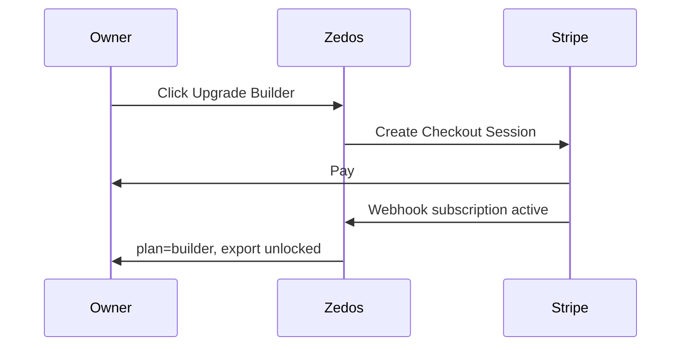

Owner : Product — Priorité : 🟠 — Mois 1

> **Dépendances :** `docs/gtm/pricing-page-copy-en-v1.md`, `docs/product/conversion-export-cursor-spec.md`. Impl = slice hors ce TODO.

# Brief produit — Stripe Subscription (plan Builder)

## User story

**En tant que** fondateur qui a validé la valeur (share ou export),  
**je veux** m’abonner au plan **Builder** en self-serve,  
**afin de** débloquer exports Cursor illimités, projets illimités et quota IA mensuel sans racheter des packs manuellement.

---

## Périmètre v1 (MVP sub)

| Inclus | Exclu |
|--------|-------|
| 1 produit Stripe **Builder Monthly** (price ID prod) | Plans annuels |
| Checkout Session **subscription** mode | Plan Pro (phase 2) |
| Webhook `customer.subscription.*` + mapping `plan=builder` en DB | Migration auto des acheteurs packs historiques |
| Customer Portal Stripe (cancel / update card) | Facturation équipe multi-sièges |
| Garde-fou : **packs one-shot** restent pour overage | Remplacement immédiat du ledger crédits |

---

## Critères d’acceptation

| # | AC |
|---|-----|
| AC-1 | Un owner Free peut lancer Checkout Builder depuis modal export ou page pricing |
| AC-2 | Après `checkout.session.completed` (subscription), le compte a `plan=builder` et export non bloqué |
| AC-3 | Annulation via Portal → fin de période → retour `plan=free` (export re-gated) |
| AC-4 | Échec paiement → email Stripe + bannière in-app « Update payment » |
| AC-5 | Pas de double abonnement si l’user achète encore un pack crédit (coexistence documentée) |
| AC-6 | TVA / tax Stripe Tax aligné FA `payments--tax-and-vat-legibility` |

---

## Objets métier

| Objet | Champ suggéré |
|-------|---------------|
| User / Account | `stripeCustomerId`, `subscriptionId`, `planTier: free \| builder \| pro`, `planRenewsAt` |

---

## Parcours

---

## Risques

| Risque | Mitigation |
|--------|------------|
| Double monétisation crédits + sub | Message « Included usage » ; packs = top-up only |
| SCA EU | Même pattern que auto-reload — manual retry UX |

---

## Livrables downstream

- Scope slice : `payments--builder-subscription-checkout` *(à créer via FA payments)*
- MAJ `docs/WORK_QUEUE.md` après validation humaine

---

## Critères doc done

- [x] US + AC + périmètre.
- [ ] Priorité P dans WORK_QUEUE validée par fondateur.
